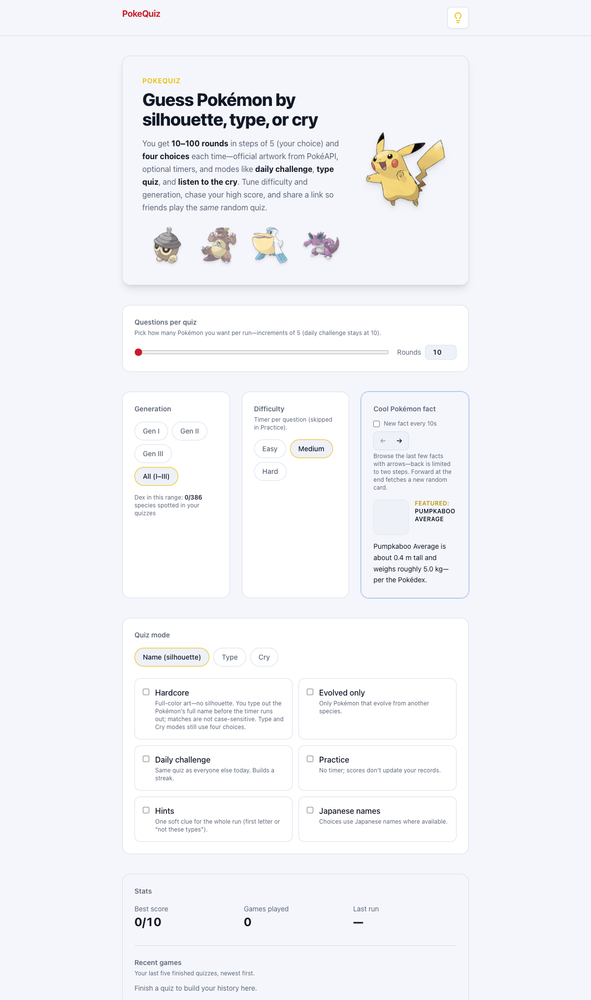

# PokeQuiz

A **Pokémon knowledge quiz** built as a modern single-page app. You identify species from **silhouette / full art**, **types**, or **cries**, tune **generations** and **difficulty**, chase **high scores**, and optionally share a **replayable** run via URL.

**Live site:** [https://poke-quiz.surge.sh](https://poke-quiz.surge.sh)

<p align="center">
  
</p>

---

## Links

| | URL |
|---|-----|
| **This project (source)** | [github.com/Mbekoe24/PokeQuiz](https://github.com/Mbekoe24/PokeQuiz) |
| **Live (Surge)** | **[poke-quiz.surge.sh](https://poke-quiz.surge.sh)** — *hosted on Surge; redeploy with `npm run deploy:surge` (see below).* |
| **Original prototype** | [poke-app repository](https://github.com/Mbekoe24/poke-app) · [live site](http://pokeapptest.surge.sh/) |

**Surge deploy** (run locally—Surge will prompt for email/password the first time):

```bash
npm run deploy:surge
```

This runs `vite build`, copies **`dist/index.html` → `dist/200.html`** (so direct visits to `/game` and `/results` work on Surge), then uploads `dist/` to **`https://poke-quiz.surge.sh`**. If that subdomain is already taken on Surge, pick another: `npx surge dist https://your-name.surge.sh`.

Other static hosts (Netlify, GitHub Pages, etc.) can still use `npm run build` and upload `dist/`; only Surge needs the extra `200.html` for SPA fallback.

**Data:** [PokéAPI](https://pokeapi.co/) (official artwork, species text, cries). No backend required—everything runs in the browser.

---

## How this differs from the first project

| | **First project** ([poke-app](https://github.com/Mbekoe24/poke-app)) | **PokeQuiz** (this repo) |
|---|--------|------------|
| **Stack** | Vanilla HTML, CSS, and JavaScript, Axios | **React 18**, **TypeScript**, **Vite 5** |
| **UI** | Hand-rolled DOM and styles | **Tailwind CSS**, component-based layout |
| **Routing** | Single page / manual flow | **React Router** (`/`, `/game`, `/results`) |
| **Scope** | Fixed 10-question run, silhouette + multiple choice | **10–100 rounds**, **Name / Type / Cry** modes, **daily challenge**, **hints**, **hardcore typing**, **PWA**, **shareable URLs** |
| **Tooling** | Manual workflow | **ESLint**, **Vitest**, **Testing Library**, **vite-plugin-pwa** |

The older app on [pokeapptest.surge.sh](http://pokeapptest.surge.sh/) proved the game loop; **PokeQuiz** keeps that spirit with a clearer architecture, accessibility-minded UI, and room to grow without rewiring globals in one file.

---

## Disclosure: use of artificial intelligence

**PokeQuiz** is a substantive **redesign and enhancement** of the author’s earlier **Poke App** (2020): a client-side Pokémon quiz originally built with **vanilla HTML, CSS, and JavaScript** ([source](https://github.com/Mbekoe24/poke-app); [live prototype](http://pokeapptest.surge.sh/)). **Generative artificial intelligence** was used to **extend the prior concept**, **preserve and improve core quiz logic**, and **implement** the present **React**, **TypeScript**, and **Vite** stack, along with additional modes, tooling, and documentation.

Assistive tools included:

- **[Cursor](https://cursor.com/)** — editor-integrated assistance and **agent-based** workflows for multi-file changes, scaffolding, configuration, and refactors.
- **[Claude](https://www.anthropic.com/)** (Anthropic), principally via **Cursor** and comparable integrated workflows — recommendations on structure, **TypeScript** / **React** patterns, **Vitest** and **Testing Library** setup, **README** and technical copy, and iterative refinement of gameplay and user experience.

The **author retains full responsibility** for requirements, review of all contributions (including AI-generated material), integration, and release. These instruments functioned as **development aids** only; they **do not supplant** human judgment or accountability for this repository or its relationship to the **2020 Poke App**.

---

## Tech stack

- **[Vite](https://vitejs.dev/)** — Fast dev server, native **ES modules**, Rollup production builds, and first-class **`import.meta.env`** for configuration.
- **React 18** — UI with hooks; **TypeScript** for typed props, game state, and API shapes.
- **React Router 6** — Declarative routes and **shareable `/game` links** (`?gen=…&diff=…&mode=…`, etc.).
- **Tailwind CSS** — Utility-first styling, dark mode via `class` strategy.
- **vite-plugin-pwa** — Service worker precache for offline shell and install prompts.
- **Vitest** + **Testing Library** — Unit tests for URL/helpers and smoke tests for the home screen (`npm run test`).
- **PokéAPI** — Public REST API (optional `VITE_POKEAPI_BASE_URL` / `VITE_POKEAPI_API_KEY` in `.env`; see below).

---

## MVP (first release scope)

- **Flow:** Home → Game → Results (opening `/game` without valid config sends you home).
- **Choices:** **4** options (labels **A–D**), keyboard **1–4** / **A–D**.
- **Content:** **Gen I**, **II**, **III**, or **All (I–III)** (national dex slice used in-app).
- **Difficulty:** **Easy 15s** / **Medium 10s** / **Hard 5s** per question (timer ring + countdown).
- **Silhouette:** Dark silhouette on official artwork until you answer or time runs out (**hardcore** turns this off—see below).
- **Progress:** Bar for completed rounds (default **10** rounds aligned with the original “10 questions” feel).
- **Results:** Correct / wrong / timed out, optional “new best”, **Play again** (same settings) or **Back home**.
- **Persistence:** `localStorage` for **theme** and **stats** (high score, games played, last run, recent list).
- **Theme:** Light / dark toggle (respects `prefers-color-scheme` until you choose).

---

## Post-MVP features (beyond the original)

- **Round count:** **10–100** questions in steps of **5** (daily challenge pins to **10**).
- **Quiz modes:** **Name** (silhouette or art), **Type**, **Cry** (audio).
- **Hardcore:** Full-color art; in **Name** mode you **type** the species (matching is **not case-sensitive**); Type/Cry still use four buttons.
- **Practice:** No timer; scores don’t update your “official” stats (checkbox on home).
- **Daily challenge:** Shared seed for the day + **streak** tracking (with local persistence).
- **Evolved only:** Restrict the pool to species that evolve from another.
- **Hints:** At most **one** soft clue per run (e.g. first letter or “not these types”).
- **Japanese names:** Prefer Japanese display names on choices where the API provides them.
- **Share / deep link:** Build URLs from home settings ([`gameUrl`](src/utils/gameUrl/) helpers); friends can open the **same** random run when the seed is in the query string.
- **PWA:** Installable app shell and precached static assets (`npm run build` generates the service worker).
- **Home “Cool Pokémon fact” card:** Rotating factoids from PokéAPI (with offline-friendly copy if a fetch fails).
- **UX polish:** “Back to home” from the game, scroll-into-view on new questions, simple **“Loading next Pokémon…”** state (no heavy spinner).
- **Quality:** **Vitest** tests for question clamping, URL parsing, seeded RNG, name matching, and main home controls.

---

## Quick start

```bash
npm install
npm run dev
```

| Script | Purpose |
|--------|--------|
| `npm run dev` | Vite dev server |
| `npm run build` | Production build → `dist/` |
| `npm run preview` | Serve `dist/` locally |
| `npm run lint` | ESLint |
| `npm run test` | Vitest (once) |
| `npm run check` | `lint` + `tsc` + `test` |

`vite.config.js` sets `base: './'` so the built app works from **subpaths** (e.g. GitHub Pages, nested Surge URLs).

---

## Environment variables

Copy [`.env.example`](.env.example) to `.env` or `.env.local` if you add one.

| Variable | Purpose |
|----------|---------|
| `VITE_POKEAPI_BASE_URL` | API root (default: `https://pokeapi.co/api/v2`). |
| `VITE_POKEAPI_API_KEY` | Optional `Authorization: Bearer …`. **Public PokéAPI does not require a key**—only use for proxies or mirrors. |

**Security:** Anything prefixed with `VITE_` is **exposed in the browser bundle**. Do not put real secrets there.

---

## Wireframes / assets

- Screenshot above: `docs/readme-screenshot.png` (captured from `npm run preview`).
- Optional mockups: [`docs/wireframes/`](docs/wireframes/) (may be empty).

---

## References

- [PokéAPI](https://pokeapi.co/)
- Legacy: [poke-app](https://github.com/Mbekoe24/poke-app), [pokeapptest.surge.sh](http://pokeapptest.surge.sh/)

*Pokémon and character names are trademarks of Nintendo, Game Freak, and The Pokémon Company. Unofficial fan/educational project.*
